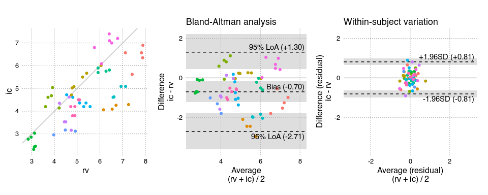

<!-- README.md is generated from README.Rmd. Please edit that file -->

# BAtrending

<!-- badges: start -->

<!-- badges: end -->

A package for conveniently conducting a Bland-Altman including
assessment of trending ability.

## Installation

You can install BAtrending from [GitHub](https://github.com/) with:

``` r
# install.packages("pak")
pak::pak("JohannesNE/BAtrending")
```

or

``` r
devtools::install_github("JohannesNE/BAtrending")
```

## Example

BAtrending package includes a small sample dataset, `CO`. It contains
paired measurements of cardiac output (CO) with two methods:
radionuclide ventriculography (rv) and impedance cardiography (ic). The
dataset was published in [Bland JM, Altman DG. (1999) Measuring
agreement in method comparison studies. Statistical Methods in Medical
Research 8, 135-160](https://doi.org/10.1177/096228029900800204).

The `CO` dataset has 60 measurements in 12 subjects.

``` r
library(BAtrending)

BA_CO <- compare_methods(CO, ref_col = "rv", alt_col = "ic", id_col = "sub")
# Bootstrap confidence intervals
BA_CO <- add_confint(BA_CO)
```

``` r
plot_BA_combine(BA_CO, aspect_ratio = 1)
```



The object (`BA_CO`) returned by `compare_methods()` contains a number
of parameters from both the standard Bland-Altman analysis and for
assessing trending ability. The `print()` method gives an overview:

``` r
BA_CO
#> 60 paired measurements in 12 subjects
#> 
#>                                    est      [95% CI] 
#> === Distribution ===
#> Mean                           :   5.035 [ 4.323;  5.722] 
#> Between-subject variation (SD) :   1.210 [ 0.712;  1.695] 
#> Within-subject variation (SD)  :   0.283 [ 0.225;  0.340] 
#> Total variation (SD)           :   1.243 [ 0.764;  1.721] 
#> 
#> === Method comparison ===
#> Bias (alt - ref)               :  -0.705 [-1.234; -0.211] 
#> Between-subject variation (SD) :   0.934 [ 0.529;  1.334] 
#> Within-subject variation (SD)  :   0.413 [ 0.325;  0.496] 
#> Total variation (SD)           :   1.022 [ 0.677;  1.398] 
#> Intraclass correlation
#>   Between/Total variance       :   0.836 [ 0.605;  0.924] 
#> 
#> Limits of agreement (95%)
#> ├ Upper limit                  :   1.298 [ 0.431;  2.222] 
#> └ Lower limit                  :  -2.707 [-3.540; -1.838] 
#> 
#> Percentage error               :   0.399 [ 0.264;  0.545] 
#> 
#> --- Trending ---
#> Within-subject perc. error     :   0.161 [ 0.127;  0.193] 
#> Change LoA [±] (95%)           :   1.146 [ 0.901;  1.374]
```

## Citation

``` r
citation("BAtrending")
```

To cite package ‘BAtrending’ in publications use:

YourLastName Y, CoauthorLastName C (2023). “BATrending paper.” *Journal
of Important Research*, *10*(2), 123-456.
<doi:10.xxxx/your.paper.doi.here>
<https://doi.org/10.xxxx/your.paper.doi.here>.

A BibTeX entry for LaTeX users is

@Article{, title = {BATrending paper}, author = {YourFirstName
YourLastName and CoauthorFirstName CoauthorLastName}, journal = {Journal
of Important Research}, year = {2023}, volume = {10}, number = {2},
pages = {123–456}, doi = {10.xxxx/your.paper.doi.here}, }

Please also cite the ‘lme4’ package, upon which ‘BAtrending’ relies
heavily. See `citation("lme4")`.
