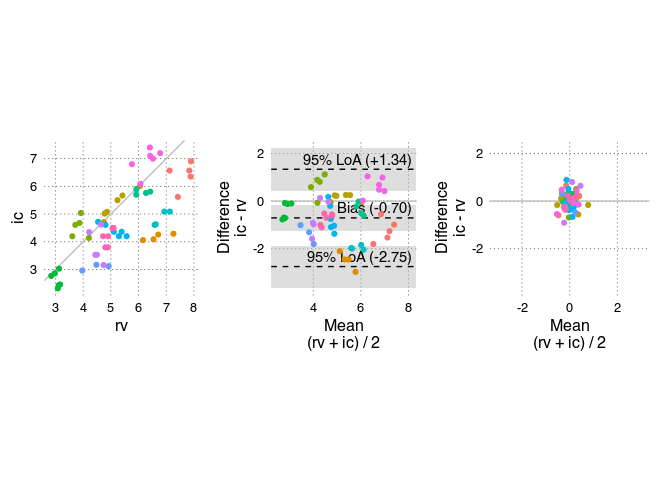

<!-- README.md is generated from README.Rmd. Please edit that file -->

# BAtrending

<!-- badges: start -->

<!-- badges: end -->

A package for conveniently conducting a Bland-Altman including
assessment of trending ability.

## Installation

You can install BAtrending from [GitHub](https://github.com/) with:

``` r
# install.packages("pak")
pak::pak("JohannesNE/BAtrending")
```

or

``` r
devtools::install_github("JohannesNE/BAtrending")
```

## Example

BAtrending package includes a small sample dataset, `CO`. It contains
paired measurements of cardiac output (CO) with two methods:
radionuclide ventriculography (rv) and impedance cardiography (ic). The
dataset was published in [Bland JM, Altman DG. (1999) Measuring
agreement in method comparison studies. Statistical Methods in Medical
Research 8, 135-160](https://doi.org/10.1177/096228029900800204).

The `CO` dataset has 60 measurements in 12 subjects.

``` r
library(BAtrending)

compare_CO <- compare_methods(CO, 
                              ref_col = "rv", 
                              alt_col = "ic", 
                              id_col = "sub")
# Bootstrap confidence intervals
compare_CO <- add_confint(compare_CO)
#> Creating 1999 bootstrap samples
#> ================================================================================

plot_BA_combine(compare_CO, fix_aspect_ratio = TRUE)
```



The object (`compare_CO`) returned by `compare_methods()` contains a
number of parameters from both the standard Bland-Altman analysis and
for assessing trending ability. The `print()` method gives an overview:

``` r
compare_CO
#> 60 paired measurements in 12 subjects
#> 
#>                                    est      [95% CI] 
#> Bias (alt - ref)               :  -0.705 [-1.250; -0.170] 
#> Between subject variation (SD) :   0.934 [ 0.520;  1.324] 
#> Within subject variation (SD)  :   0.413 [ 0.333;  0.496] 
#> Total variation (SD)           :   1.022 [ 0.667;  1.396] 
#> Intraclass correlation
#>   Between/Total variance       :   0.836 [ 0.599;  0.922] 
#> 
#> Limits of agreement (95%)
#> ├ Upper limit                  :   1.339 [ 0.417;  2.249] 
#> └ Lower limit                  :  -2.748 [-3.662; -1.869] 
#> 
#> Perc. error (95%)              :   0.407 [ 0.265;  0.556] 
#> 
#> --- Trending ---
#> Trending precicion (95%)       :   0.827 [ 0.666;  0.992] 
#> Perc. trending precision (95%) :   0.165 [ 0.133;  0.197] 
#> 
#> Limits of agreement for changes (95%)
#> ├ Upper limit                  :   1.169 [ 0.942;  1.403] 
#> └ Lower limit                  :  -1.169 [-1.403; -0.942]
```

## Citation

``` r
citation("BAtrending")
```

To cite package ‘BAtrending’ in publications use:

YourLastName Y, CoauthorLastName C (2023). “BATrending paper.” *Journal
of Important Research*, *10*(2), 123-456.
<doi:10.xxxx/your.paper.doi.here>
<https://doi.org/10.xxxx/your.paper.doi.here>.

A BibTeX entry for LaTeX users is

@Article{, title = {BATrending paper}, author = {YourFirstName
YourLastName and CoauthorFirstName CoauthorLastName}, journal = {Journal
of Important Research}, year = {2023}, volume = {10}, number = {2},
pages = {123–456}, doi = {10.xxxx/your.paper.doi.here}, }

Please also cite the ‘lme4’ package, upon which ‘BAtrending’ relies
heavily. See `citation("lme4")`.
