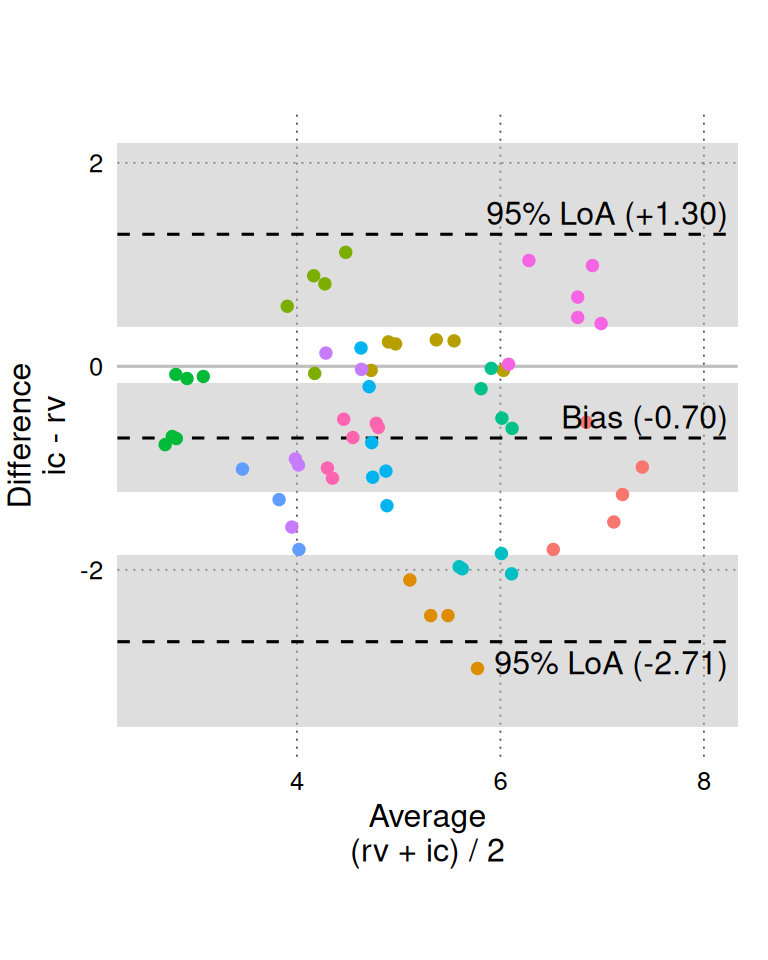
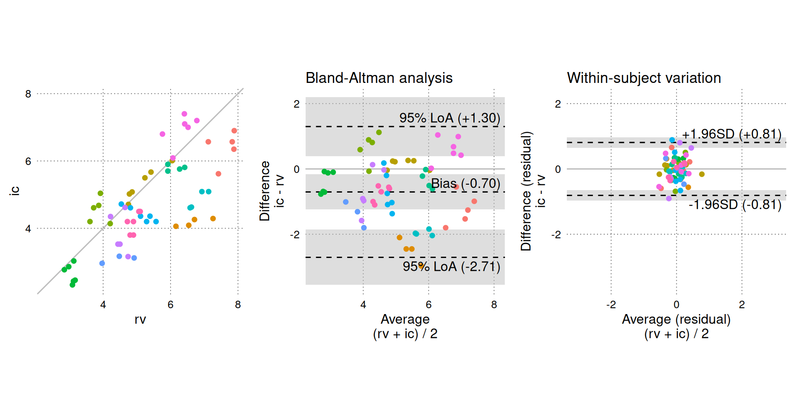
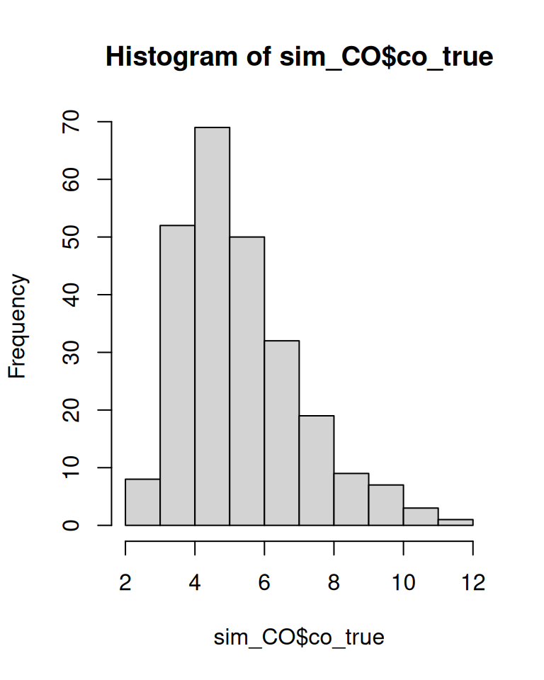
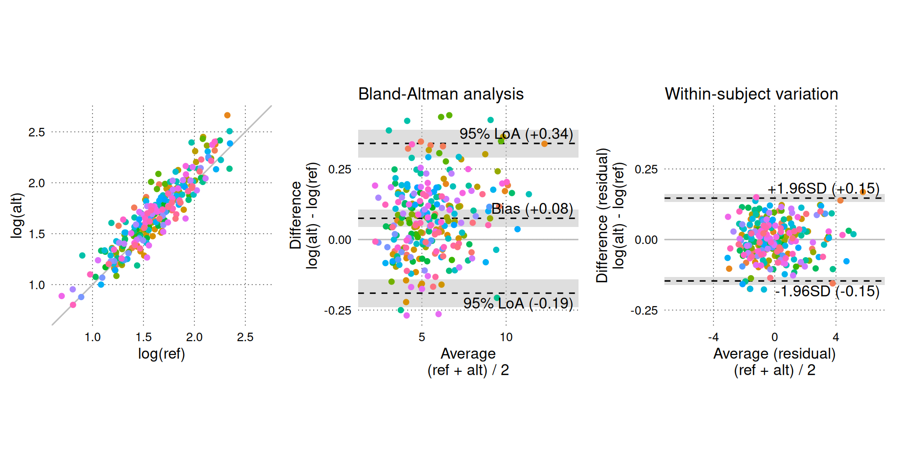

# Introduction to BAtrending

## Setup

First, install the package using `pak::pak("JohannesNE/BAtrending")`  
or `remotes::install_github("JohannesNE/BAtrending")`.

Load the package (this tutorial also uses the package `dplyr`):

``` r
library(BAtrending)
library(dplyr)
```

## A simple example

The BAtrending package includes a small sample dataset, `CO`. It
contains paired measurements of cardiac output (CO) using two methods:
radionuclide ventriculography (rv) and impedance cardiography (ic). The
dataset was published in [Bland JM, Altman DG. (1999) Measuring
agreement in method comparison studies. Statistical Methods in Medical
Research 8, 135-160](https://doi.org/10.1177/096228029900800204).

The `CO` dataset contains 60 measurements from 12 subjects.

``` r
head(CO)
#>   sub   rv   ic
#> 1   1 7.83 6.57
#> 2   1 7.42 5.62
#> 3   1 7.89 6.90
#> 4   1 7.12 6.57
#> 5   1 7.88 6.35
#> 6   2 6.16 4.06
```

[`compare_methods()`](https://johannesne.github.io/BAtrending/reference/compare_methods.md)
is the primary analysis function in `BAtrending`.

[`compare_methods()`](https://johannesne.github.io/BAtrending/reference/compare_methods.md)
uses [`lme4::lmer()`](https://rdrr.io/pkg/lme4/man/lmer.html) to fit a
mixed model with differences (`D = alt - ref`) as the dependent
variable. From this model, Bland-Altman statistics and trending
parameters are calculated, accounting for repeated measurements.
Additionally, a mixed model with averages (`avg = (alt + ref)/2`) as the
dependent variable is fit. This second model is used to determine the
between-subject and within-subject distribution of the measured
variable. Later, we demonstrate how to [manually fit the mixed model and
extract relevant
features](#manually-fit-the-mixed-model-and-extract-features).

``` r
BA_CO <- compare_methods(
  CO,
  ref_col = rv,
  alt_col = ic,
  id_col = sub
)
# Bootstrap confidence intervals.
# `nsim` should probably be at least 2000 for real use.
BA_CO <- add_confint(BA_CO, nsim = 999, .progress = "none")
```

We can view the raw data (`rv` and `ic`) using
[`BA_plot_scatter()`](https://johannesne.github.io/BAtrending/reference/BA_plot_scatter.md).
It is generally recommended to set the aspect ratio to 1 for easy
comparison between the methods.

``` r
BA_plot_scatter(BA_CO, aspect_ratio = 1)
```


A standard Bland-Altman plot is created with
[`BA_plot()`](https://johannesne.github.io/BAtrending/reference/BA_plot.md).

``` r
BA_plot(BA_CO, aspect_ratio = 1)
```



[`BA_plot_combine()`](https://johannesne.github.io/BAtrending/reference/BA_plot_combine.md)
is a convenience function that combines three plots: the scatter plot
and Bland-Altman plot shown above and a residuals plot. The residuals
plot shows only the within-subject variation, which is the only
variation relevant for assessing trending agreement (the residuals plot
can be created directly with
[`BA_plot_residuals()`](https://johannesne.github.io/BAtrending/reference/BA_plot_residuals.md)).

Setting `equal_scales = TRUE` (default) matches the dimensions of the
residuals plot to the standard Bland-Altman plot, so we can visually
compare the within-subject variation (right panel) to the total
variation shown in the Bland-Altman analysis (middle panel).

``` r
BA_plot_combine(BA_CO, aspect_ratio = 1, equal_scales = TRUE)
```



On the Y-axis of the residuals plot, we observe that there is little
within-subject variation in the difference between simultaneous
measurements, especially compared to the total variation (Y-axis of the
middle panel). By itself, this suggests good trending agreement, but we
must also consider how much CO acutally varied in the study. The average
CO ($(rv + ic)/2$) represents our best guess of the true CO and is
plotted on the X-axis of the middle and right panels. The middle panel
shows that a wide range of CO values are included in the study, but the
right panel reveals that the within-subject variation in CO is very
limited. We do not know how the within-subject variability would change
if CO itself varied significantly within subjects; therefore, we cannot
confidently interpret the low within-subject variability as “good”
trending agreement.

The results from the analysis can be shown in table form in the console
with `print(BA_CO)` or by simply calling the object name:

``` r
BA_CO
#> 60 paired measurements in 12 subjects
#> 
#>                                    est      [95% CI] 
#> === Distribution ===
#> Mean                           :   5.035 [ 4.351;  5.718] 
#> Between-subject variation (SD) :   1.210 [ 0.723;  1.685] 
#> Within-subject variation (SD)  :   0.283 [ 0.230;  0.340] 
#> Total variation (SD)           :   1.243 [ 0.778;  1.705] 
#> 
#> === Method comparison ===
#> Bias (alt - ref)               :  -0.705 [-1.223; -0.159] 
#> Between-subject variation (SD) :   0.934 [ 0.542;  1.319] 
#> Within-subject variation (SD)  :   0.413 [ 0.321;  0.494] 
#> Total variation (SD)           :   1.022 [ 0.679;  1.385] 
#> Intraclass correlation
#> └ Between/Total variance       :   0.836 [ 0.623;  0.924] 
#> Limits of agreement (95%)
#> ├ Upper limit                  :   1.298 [ 0.403;  2.127] 
#> └ Lower limit                  :  -2.707 [-3.588; -1.843] 
#> Percentage error               :   0.398 [ 0.265;  0.541] 
#> 
#> --- Trending ---
#> Within-subject perc. error     :   0.161 [ 0.125;  0.193] 
#> Change LoA [±] (95%)           :   1.146 [ 0.891;  1.368]
```

A publication-ready table is created with:

``` r
BA_table(BA_CO)
```

|                                                                                    | Estimate \[95% CI\]               |
|------------------------------------------------------------------------------------|-----------------------------------|
| **Distribution**¹                                                                  | **Distribution**                  |
| Mean                                                                               | 5.03 \[4.35; 5.72\]               |
| Between-subject SD                                                                 | 1.21 \[0.72; 1.69\]               |
| Within-subject SD                                                                  | 0.28 \[0.23; 0.34\]               |
| Total SD                                                                           | 1.24 \[0.78; 1.70\]               |
| **Method comparison (alt - ref)**                                                  | **Method comparison (alt - ref)** |
| Bias (\\bias_D\\)                                                                  | -0.70 \[-1.22; -0.16\]            |
| Between-subject SD (\\\sigma\_{between,D}\\)                                       | 0.93 \[0.54; 1.32\]               |
| Within-subject SD (\\\sigma\_{within,D}\\)                                         | 0.41 \[0.32; 0.49\]               |
| Total SD (\\\sigma\_{total,D}\\)                                                   | 1.02 \[0.68; 1.39\]               |
| Limits of agreement (95%)                                                          | Limits of agreement (95%)         |
|   Upper limit                                                                      | 1.30 \[0.40; 2.13\]               |
|   Lower limit                                                                      | -2.71 \[-3.59; -1.84\]            |
| Percentage error²                                                                  | 39.8 \[26.5; 54.1\] %             |
| Within-subject percentage error²                                                   | 16.1 \[12.5; 19.3\] %             |
| Change limits of agreement (95%)³                                                  | ±1.15 \[0.89; 1.37\]              |
| ¹ Distribution of the averages of simultaneous measurements (alt + ref)/2.         |                                   |
| ² Percentage error = 1.96 · \\\sigma\_{total,D}\\ (or \\\sigma\_{within,D}\\)/mean |                                   |
| ³ Change limits of agreement (95%) = 1.96 · √2 · \\\sigma\_{within,D}\\.           |                                   |
|  SD: standard deviation; alt: alternative method; ref: reference method            |                                   |

[`BA_table()`](https://johannesne.github.io/BAtrending/reference/BA_table.md)
uses
[`tinytable::tt()`](https://vincentarelbundock.github.io/tinytable/man/tt.html)
and can be exported to several common formats including PDF and .docx
(see
[`tinytable::save_tt()`](https://vincentarelbundock.github.io/tinytable/man/save_tt.html)).

## Proportional errors - logarithmic transformation

In the example above, we assumed that measurement errors were
independent of the true CO. This assumption is supported by the
Bland-Altman plot and residuals plots, which do not indicate a
relationship between the average CO and the variation in measurement
differences.

However, it is common to encounter data, or have prior knowledge,
suggesting that measurement errors increase proportionally to the
measured value.

In the following section, we will simulate simultaneous measurements of
CO with two methods that have measurement errors proportional to the
true CO.

First, we simulate 5 true CO values in each of 50 subjects. `BAtrending`
provides a convenience function,
[`simulate_repeated_data()`](https://johannesne.github.io/BAtrending/reference/simulate_repeated_data.md),
for this purpose.

``` r
set.seed(1)

sim_CO <- simulate_repeated_data(
  n_sub = 50, # subjects
  n_rep = 5, # repetitions
  avg = 5, # Overall average CO.
  # Between-subject variation in CO
  between_sub_sd = 0.5,
  # Within-subject variation in CO (relative to the mean CO for the subject).
  within_sub_rel_change_sd = 0.3,
  var_name = "co_true"
)
head(sim_CO)
#>   id  co_true
#> 1  1 5.281320
#> 2  1 3.900623
#> 3  1 5.191799
#> 4  1 3.339882
#> 5  1 7.204108
#> 6  2 9.223510

hist(sim_CO$co_true, breaks = 10)
```



Now, we simulate measurements of the true CO using the function
[`simulate_measurement()`](https://johannesne.github.io/BAtrending/reference/simulate_measurement.md):

``` r
sim_CO <- sim_CO |>
  mutate(
    # Reference method
    ref = simulate_measurement(
      true_val = co_true,
      sub_id = id,
      mean_bias = log(1), # 0, no bias.
      # between-subject variation of 5% of true CO.
      sub_bias_sd = log(1.05),
      # within-subject variation of 5% of true CO.
      residual_error_sd = log(1.05),
      proportional_errors = TRUE
    ),
    # Alternative method
    alt = simulate_measurement(
      true_val = co_true,
      sub_id = id,
      mean_bias = log(1.1), # 10% higher than true CO.
      # between-subject variation of 10% of true CO.
      sub_bias_sd = log(1.1),
      # within-subject variation of 5% of true CO.
      residual_error_sd = log(1.05),
      proportional_errors = TRUE
    )
  )

head(sim_CO)
#>   id  co_true      ref       alt
#> 1  1 5.281320 5.928015  5.640380
#> 2  1 3.900623 4.211349  3.989880
#> 3  1 5.191799 5.524657  6.044544
#> 4  1 3.339882 3.456067  3.316707
#> 5  1 7.204108 8.127387  7.766766
#> 6  2 9.223510 9.022741 10.143470
```

We first perform a Bland-Altman analysis on an absolute (non-log) scale.

``` r
BA_sim_abs <- compare_methods(
  sim_CO,
  ref_col = ref,
  alt_col = alt,
  id_col = id
)
# Increase nsim for real use.
BA_sim_abs <- add_confint(BA_sim_abs, nsim = 999, .progress = "none")

BA_plot_combine(BA_sim_abs, aspect_ratio = 1)
```


The funnel-shaped scatter of differences in the Bland-Altman plot
(middle panel) clearly indicates that the magnitude of the differences
increases with higher CO.

We instead perform the analysis on log-transformed measurements. This
corresponds to an assumption that measurement errors are proportional to
the true CO. Specifically, that the *ratios* between simultaneous
measurements from two methods are independent of the true CO.

$$\log(alt) - \log(ref) = \log\left( \frac{alt}{ref} \right)$$

``` r
BA_sim_log <- compare_methods(
  sim_CO,
  ref_col = ref,
  alt_col = alt,
  id_col = id,
  logtrans = TRUE
)

# Increase nsim for real use.
BA_sim_log <- add_confint(BA_sim_log, nsim = 999, .progress = "none")

BA_plot_combine(BA_sim_log, aspect_ratio = 1, keep_log_scale = TRUE)
```



``` r
# aspect_ratio only affects the scatter plot (left panel) for
# log-transformed data.
```

On log-transformed measurements, there is no relationship between CO and
agreement between methods (of course, this was expected, as we generated
the data with proportional errors).

The results from the Bland-Altman analysis on log-transformed
measurements (e.g. bias, limits of agreement and change limits of
agreement) can be exponentiated and interpreted on the original scale.
The interpretation of these back-transformed results is that they
estimate ratios between the measurements instead of absolute
differences.

``` r
BA_plot_combine(BA_sim_log, aspect_ratio = 1, keep_log_scale = FALSE)
```


A ratio of 1 signifies “no bias” ($alt = ref$). The Y-axis is shown with
logarithmic intervals to appropriately balance the ratios visually
(i.e. an increase of 25% is balanced by a decrease of 20%).

A relative bias of 1.08 indicates that the alternative method measures
8% more than the reference method on average. Relative limits of
agreement define the interval in which ratios between future paired
measurements (in a random subject) with the same alternative and
reference methods are expected to fall in 95% of cases.

We can also show the results of the log-transformed Bland-Altman
analysis on the non-transformed data with:

``` r
BA_plot_normalized_log(BA_sim_log, aspect_ratio = 1)
```


Again, we can generate a table of the back-transformed (exponentiated)
results:

``` r
BA_table(BA_sim_log, keep_log_scale = FALSE)
```

|                                                                                                     | Estimate \[95% CI\]                                   |
|-----------------------------------------------------------------------------------------------------|-------------------------------------------------------|
| **Distribution**¹                                                                                   | **Distribution**                                      |
| Mean                                                                                                | 5.58 \[5.28; 5.87\]                                   |
| Between-subject SD                                                                                  | 0.67 \[0.19; 0.98\]                                   |
| Within-subject SD                                                                                   | 1.73 \[1.57; 1.90\]                                   |
| Total SD                                                                                            | 1.86 \[1.70; 2.04\]                                   |
| **Method comparison, exp(log-analysis), (alt / ref)**                                               | **Method comparison, exp(log-analysis), (alt / ref)** |
| Bias (\\bias_D\\)                                                                                   | 1.08 \[1.05; 1.11\]                                   |
| Between-subject SD (\\\sigma\_{between,D}\\)                                                        | 1.12 \[1.09; 1.15\]                                   |
| Within-subject SD (\\\sigma\_{within,D}\\)                                                          | 1.08 \[1.07; 1.09\]                                   |
| Total SD (\\\sigma\_{total,D}\\)                                                                    | 1.14 \[1.12; 1.17\]                                   |
| Limits of agreement (95%)                                                                           | Limits of agreement (95%)                             |
|   Upper limit                                                                                       | 1.41 \[1.34; 1.47\]                                   |
|   Lower limit                                                                                       | 0.83 \[0.79; 0.87\]                                   |
| Percentage error²                                                                                   | –                                                     |
| Within-subject percentage error²                                                                    | –                                                     |
| Change limits of agreement (95%)³                                                                   | ×/÷1.23 \[1.21; 1.26\]                                |
| ¹ Distribution of the averages of simultaneous measurements (alt + ref)/2.                          |                                                       |
| ² Percentage error = 1.96 · \\\sigma\_{total,D}\\ (or \\\sigma\_{within,D}\\)/mean                  |                                                       |
| ³ Change limits of agreement (95%) = 1.96 · √2 · \\\sigma\_{within,D}\\.                            |                                                       |
|  SD: standard deviation; alt: alternative method; ref: reference method; ×/÷: multiply or divide by |                                                       |

The back-transformed *change limits of agreement* is 1.23. This is
interpreted as: if we measure a change in CO with both methods
simultaneously, we expect the change from one method to be at most 23%
higher than the other method in 95% of cases.

Percentage errors are not meaningful for log-transformed data and are
also not needed. A Bland-Altman analysis on log-transformed data
inherently gives measures of agreement that are relative to the measured
value.

To compare results from an analysis on log-transformed measurements with
an analysis on absolute (non-transformed) measurements, the SD of
differences between log-transformed measurements
($D_{\log} = \log\left( CO_{alt} \right) - \log\left( CO_{ref} \right)$)
is approximately equal to the SD of differences on the original
measurements ($D$) relative to the mean of these measurements:

$$SD\left( D_{\log} \right) \approx \frac{SD(D)}{mean\left( CO_{alt},CO_{ref} \right)},$$

when $SD\left( D_{\log} \right)$ is less than approximately 0.3. Note
that $\log$ must be the natural logarithm (base $e$) for this
approximate equality to hold.

Thus, $1.96*SD_{total}$ on the log scale is approximately equal to the
“percentage error” that would be calculated on the original scale.

This is analogous to how the coefficient of variation
($CV = SD(x)/mean(x)$) is approximately equal to
$SD\left( log(x) \right)$[¹](#fn1).

## Manually fit the mixed model and extract features

While `BAtrending` conveniently fits a mixed effects model and extracts
relevant variables, it is useful to understand how to do this manually.

We will use the `CO` dataset again, and use
[`lme4::lmer()`](https://rdrr.io/pkg/lme4/man/lmer.html) to fit the same
model as used in
[`compare_methods()`](https://johannesne.github.io/BAtrending/reference/compare_methods.md).

First, we calculate the difference and average for each pair of
simultaneous measurements.

``` r
CO_diff_avg <- mutate(CO, diff = ic - rv, avg = (ic + rv) / 2)
head(CO_diff_avg)
#>   sub   rv   ic  diff   avg
#> 1   1 7.83 6.57 -1.26 7.200
#> 2   1 7.42 5.62 -1.80 6.520
#> 3   1 7.89 6.90 -0.99 7.395
#> 4   1 7.12 6.57 -0.55 6.845
#> 5   1 7.88 6.35 -1.53 7.115
#> 6   2 6.16 4.06 -2.10 5.110
```

``` r
library(lme4)

mod <- lmer(diff ~ 1 + (1 | sub), data = CO_diff_avg)
summary(mod)
#> Linear mixed model fit by REML ['lmerMod']
#> Formula: diff ~ 1 + (1 | sub)
#>    Data: CO_diff_avg
#> 
#> REML criterion at convergence: 103.1
#> 
#> Scaled residuals: 
#>      Min       1Q   Median       3Q      Max 
#> -2.19408 -0.62492 -0.08043  0.57449  2.15307 
#> 
#> Random effects:
#>  Groups   Name        Variance Std.Dev.
#>  sub      (Intercept) 0.8728   0.9342  
#>  Residual             0.1708   0.4133  
#> Number of obs: 60, groups:  sub, 12
#> 
#> Fixed effects:
#>             Estimate Std. Error t value
#> (Intercept)  -0.7045     0.2752   -2.56
```

We can see that the bias (the only fixed effect) is -0.70, the
between-subject SD is 0.93 and within-subject (Residual) SD is 0.41.

To extract these values programmatically, use:

``` r
bias <- fixef(mod)[[1]] # Get intercept from model
# Get variance components (SD)
sd_components <- as.data.frame(VarCorr(mod))[['sdcor']]
```

Most Bland-Altman statistics are calculated from these values:

``` r
calc_BA_stats_from_model <- function(m) {
  bias <- fixef(m)[[1]] # Get intercept from model
  # Get variance components (SD)
  sd_components <- as.data.frame(VarCorr(m))[['sdcor']]

  sd.between <- unname(sd_components[1])
  sd.within <- unname(sd_components[2])
  sd.total <- sqrt(sd.between^2 + sd.within^2)

  intraclass.correlation <- sd.between^2 / sd.total^2

  loa.lwr <- bias - 1.96 * sd.total
  loa.upr <- bias + 1.96 * sd.total

  change.loa <- 1.96 * sqrt(2) * sd.within

  c(
    bias = bias,
    sd.between = sd.between,
    sd.within = sd.within,
    sd.total = sd.total,
    intraclass.correlation = intraclass.correlation,
    loa.lwr = loa.lwr,
    loa.upr = loa.upr,
    change.loa = change.loa
  )
}

ba_stats <- calc_BA_stats_from_model(mod)
ba_stats
#>                   bias             sd.between              sd.within 
#>             -0.7045210              0.9342410              0.4132823 
#>               sd.total intraclass.correlation                loa.lwr 
#>              1.0215716              0.8363349             -2.7068013 
#>                loa.upr             change.loa 
#>              1.2977593              1.1455601
```

Percentage errors also require knowing the mean of the measurements.

``` r
mean_val <- mean(CO_diff_avg$avg)

percentage.error <- 1.96 * ba_stats["sd.total"] / mean_val
percentage.error.within <- 1.96 * ba_stats["sd.within"] / mean_val

c(
  percentage.error = percentage.error,
  percentage.error.within = percentage.error.within
)
#>         percentage.error.sd.total percentage.error.within.sd.within 
#>                         0.3986290                         0.1612675
```

Here, we use the simple mean of all measurements. In
[`compare_methods()`](https://johannesne.github.io/BAtrending/reference/compare_methods.md)
the mean value is estimated from a mixed model that accounts for
repeated measurements within subjects (`avg ~ 1 + (1|sub)`). This model
is also used for describing the distribution of measurements
(e.g. `BA_CO$distribution_stats`).

### Bootstrap confidence intervals

To calculate confidence intervals (CI) for the Bland-Altman statistics,
we can use a parametric bootstrap on the model.

``` r
lme4::confint.merMod(
  mod,
  FUN = calc_BA_stats_from_model,
  level = 0.95,
  method = "boot",
  nsim = 500, # increase nsim for actual analysis
  boot.type = "perc",
  .progress = "none" # hide progress bar
)
#>                             2.5 %     97.5 %
#> bias                   -1.2600445 -0.1602803
#> sd.between              0.5162210  1.3585029
#> sd.within               0.3322510  0.4909408
#> sd.total                0.6731298  1.4198371
#> intraclass.correlation  0.5888612  0.9237231
#> loa.lwr                -3.6339916 -1.7802937
#> loa.upr                 0.3360198  2.2223549
#> change.loa              0.9209529  1.3608186
```

This does not calculate CIs for the percentage errors, since this
requires an estimate of the mean CO, which is not part of this mixed
model. In `BAtrending`, CIs for percentage error are calculated by
scaling the CI for `sd.total`, treating the mean CO as a known value.
Ideally, the uncertainty of the mean CO should be included in the CI for
the percentage error.

------------------------------------------------------------------------

1.  R. C. Lewontin, On the Measurement of Relative Variability,
    Systematic Biology, Volume 15, Issue 2, June 1966, Pages 141–142,
    https://doi.org/10.2307/sysbio/15.2.141
